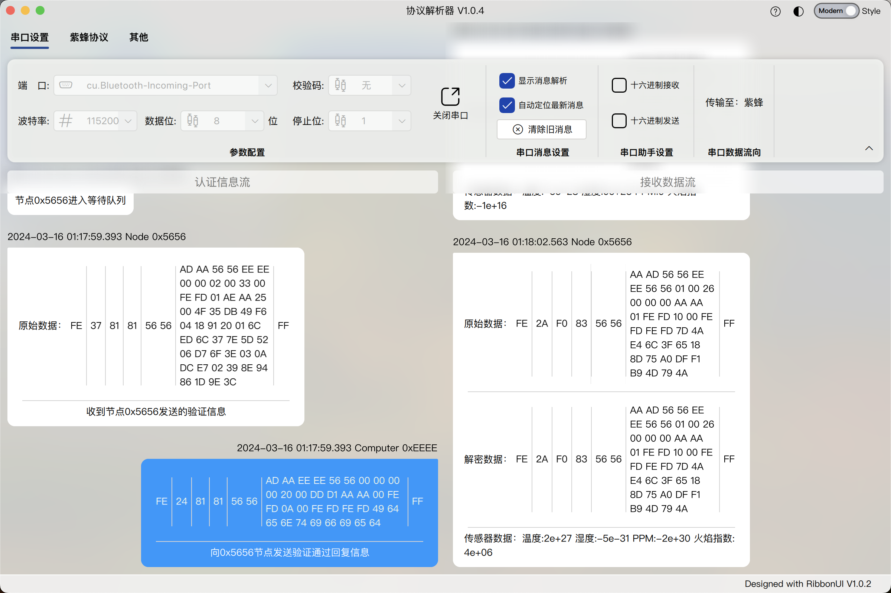
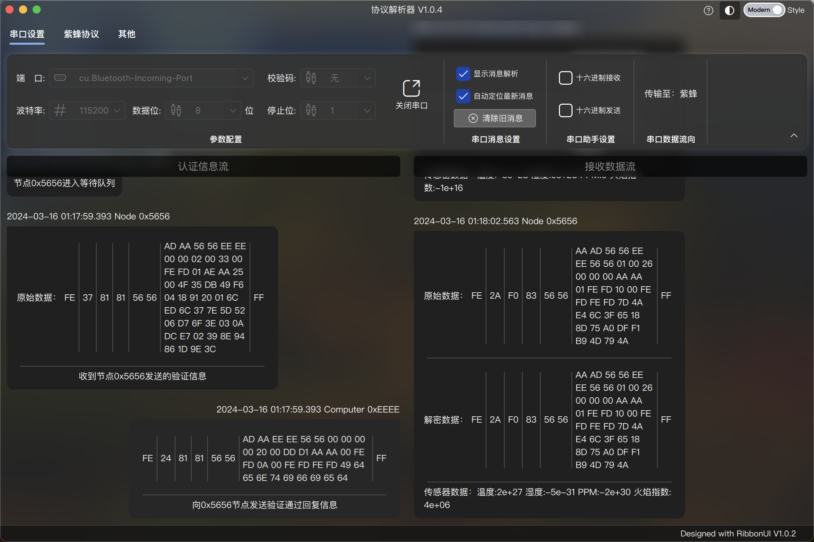

# ProtocolParser

    

<h1 align="center"> ProtocolParser 协议解析器 V1.0.4</h1>

## 一、介绍
这是一个用于与DKY的THM3682实验箱搭配使用的上位机协议解析器，具体如何使用请看[使用说明](#二使用说明)。

    

        
        
    

    
 主界面（浅色/深色模式） 

## 二、使用说明
## 1. [协议解析](documents/protocol.md)
+ 概述
+ 密钥
+ 认证流程
+ 数据结构
+ 接口解析
## 2. [串口使用](documents/serialport.md)
+ 参数配置
+ 串口消息设置
+ 串口助手设置
+ 串口数据流向
## 3. [紫蜂协议](documents/zigbee.md)
+ 设备列表
+ 密钥管理
+ 调试选项
## 4. [其他](documents/others.md)
+ 主题
+ 数据结构自定义