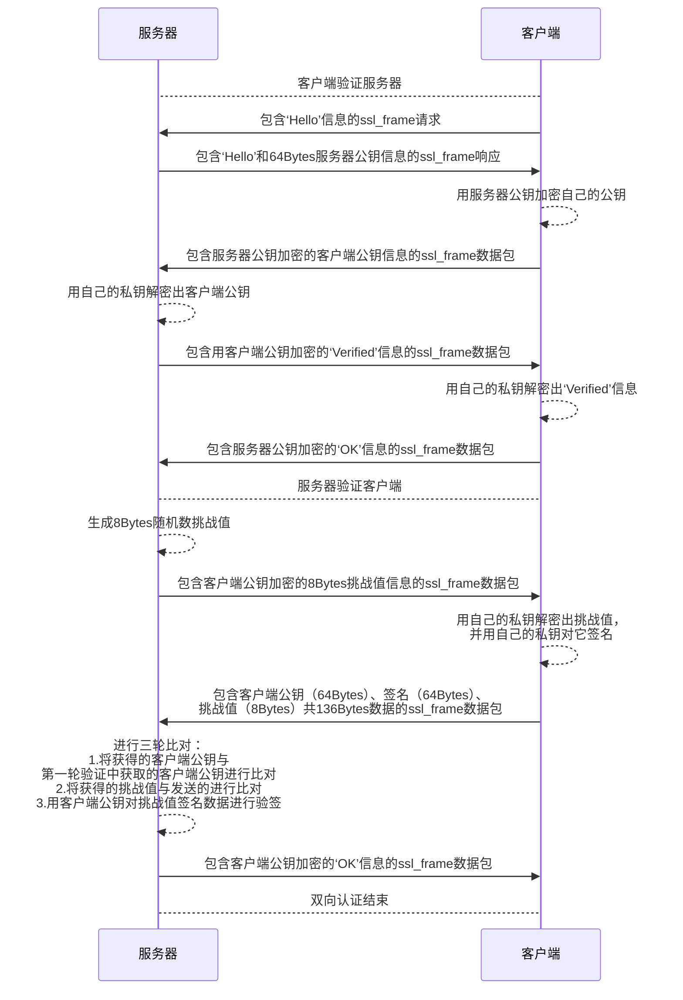
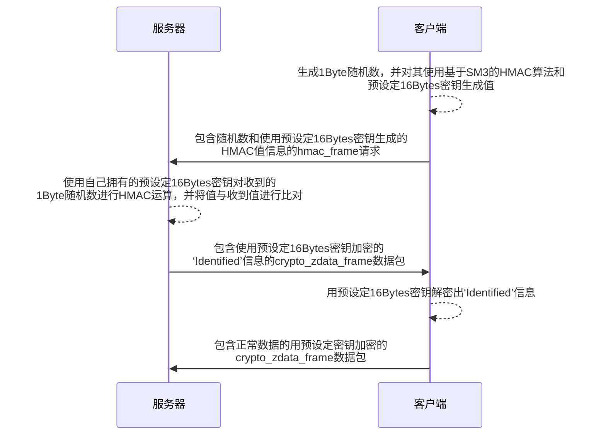

## 1. 概述
本协议是一套运行在应用层的，用于端到端通讯的轻量级安全协议，支持非对称/对称的双向、单向认证及加密通讯。该协议的认证和加密通讯由SM系列（SM2、SM3、SM4）算法保障，安全性较强，可抵御重放攻击。协议易拓展，数据包采用二进制传输，适合在多种窄带宽场景下使用（目前已在嵌入式、ARM、X86/64平台上测试通过）。

## 2. 密钥
本协议采用两类密钥：一是用于双向认证的SM2公私钥对，二是用于对称双、单向认证和加密传输的SM4密钥。
+ SM2密钥长度为：公钥64Bytes（512Bits），私钥32 Bytes（256Bits）。密文长度为明文长度再加上96Bytes。签名长度为64Bytes（被签名数据内包含随机数盐值，因此对同一数据签名的结果不相同）。
+ SM4密钥长度为：16Bytes（128Bits）。

## 3. 认证流程
### 3.1 非对称双向认证
由于SM2算法会占用一部分资源，非对称双向认证一般用于性能较好的终端（如性能较强的单片机、树莓派或者PC等设备）之间的认证，性能较差的单片机将会出现死机等预料外情况（板载硬件密码算法模块除外）。

### 3.2 对称双向认证
对称双向认证使用基于SM3的HMAC算法实现。通过验证双方是否共同持有同一对预设定密钥来实现认证，在实际运用过程中，为节省资源，服务器发送给客户端的‘Identified’信息可不加密，采用明文传输（因为后续传输的数据包均为加密数据包）。

## 4. 数据结构
### 4.1 基础帧（base_frame）
基础帧是本协议传输最底层的帧，用于承载其他帧。
| 帧结构 | 长度（Bytes） | 说明 |
|:----:|:----:|:----:|
| head | 2 | 包头，数值固定为`0xAAAD` |
| ori_addr | 2 | 源地址，即该帧发送方的地址 |
| des_addr | 2 | 目的地址，即该帧接收方的地址 |
| node_addr | 2 | 节点地址，仅在此帧被服务器进行路由时使用， 用以标记该帧由哪个节点最先产生 |
| id | 2 | 帧标号，用以与`rand_num`共同唯一标记一个帧，防止重放攻击 |
| length | 2 | 帧长度（包括帧头），最大为65535个Bits |
| reset_num | 1 | 重置标记位，用以告知对方在接收此帧后， 下一帧的帧标号将归零，`rand_num`将被重新生成 |
| rand_num | 1 | 随机数 |
| data | 可变长度 | 数据最大不超过（8191 - `BASE_FRAME_PREFIX_LEN`）= 8177 |

另有其他说明如下：
+ 宏定义`BASE_FRAME_PREFIX_LEN`：基础帧帧头长度，固定为14Bytes
+ 宏定义`BASE_FRAME_HEAD`：基础帧帧头，固定为`0xAAAD`
+ 宏定义`BASE_FRAME_RESET_NUM`：基础帧重置阈值：当发送帧数达到该阈值时，下一帧将被重置帧标号和随机数，该阈值一般为`10000`，最大不超过`65535`
+ 宏定义`new_base_frame(num)`：用以生成基础帧数据结构，`num`为`data`部分长度，使用时请注意强制类型转换
### 4.2 数据帧（data_frame）
数据帧是本协议传输中最顶层的帧，用于承载各类数据。
| 帧结构 | 长度（Bytes） | 说明 |
|:----:|:----:|:----:|
| head | 2 | 包头，数值固定为`0xAAAA` |
| type | 1 | 数据类型，由用户根据业务不同自定义 |
| use_crc | 1 | CRC标记位，当其为`0xFF`时将对数据进行CRC校验 |
| data_length | 2 | 数据长度，不包括包头 |
| crc | 2 | CRC16校验码，当CRC标记位使能且对数据进行CRC校验后数值与该码不同，包将被判定为损坏 |
| data | 可变长度 | 根据底层帧的不同，数据最大不超过（8191 - `BASE_FRAME_PREFIX_LEN` - `DATA_FRAME_PREFIX_LEN`）= 8169，若叠加多重帧，需要减去对应帧的帧头 |

另有其他说明如下：
+ 宏定义`DATA_FRAME_PREFIX_LEN`：数据帧帧头长度，固定为8Bytes
+ 宏定义`DATA_FRAME_HEAD`：数据帧帧头，固定为`0xAAAA`
+ 宏定义`new_data_frame(num)`：用以生成数据帧数据结构，`num`为`data`部分长度，使用时请注意强制类型转换
### 4.3 数字信封（digi_env）
数字信封是通信双方进行非对称双向认证后，用于加密传输数据的数据结构。
| 帧结构 | 长度（Bytes） | 说明 |
|:----:|:----:|:----:|
| head | 2 | 包头，数值固定为`0xAAAB` |
| length | 2 | 长度，包括包头 |
| crypted_session_key | 112 | 由接收方公钥加密的16Bytes会话密钥再加上96Bytes的额外数据 |
| data | 可变长度 | 由会话密钥进行SM4加密的数据长度，数据最大不超过（8191 - `BASE_FRAME_PREFIX_LEN` - `DIGI_ENV_PREFIX_LEN` - `DIGI_ENV_SESSION_KEY_LEN`）= 8061，又因SM4的密文为16的倍数，因此最大不能超过8048 |

另有其他说明如下：
+ 宏定义`SM4_PADDING_LEN`：SM4默认填充长度，固定为16Bytes
+ 宏定义`DIGI_ENV_PREFIX_LEN`：数字信封包头长度，固定为4Bytes
+ 宏定义`DIGI_ENV_SESSION_KEY_LEN`：数字信封密态会话密钥长度，固定为112Bytes
+ 宏定义`DIGI_ENV_HEAD`：数字信封包头，固定为`0xAAAB`
+ 宏定义`new_digi_env(num)`：用以生成数字信封数据结构，`num`为`data`部分长度，使用时请注意强制类型转换
### 4.4 非对称双向认证包（ssl_frame）
非对称双向认证包负责承载非对称双向认证相关数据。
| 帧结构 | 长度（Bytes） | 说明 |
|:----:|:----:|:----:|
| head | 2 | 包头，数值固定为`0xAAAC` |
| length | 2 | 长度，包括包头 |
| data | 可变长度 | 数据最大不超过（8191 - `BASE_FRAME_PREFIX_LEN` - `SSL_FRAME_PREFIX_LEN`）= 8173 |

另有其他说明如下：
+ 宏定义`SSL_FRAME_PREFIX_LEN`：非对称双向认证包包头长度，固定为4Bytes
+ 宏定义`SSL_FRAME_HEAD`：非对称双向认证包包头，固定为`0xAAAC`
+ 宏定义`new_ssl_frame(num)`：用以生成非对称双向认证包数据结构，`num`为`data`部分长度，使用时请注意强制类型转换
### 4.5 对称双向认证包（hmac_frame）
对称双向认证包负责承载对称双向认证相关数据。
| 帧结构 | 长度（Bytes） | 说明 |
|:----:|:----:|:----:|
| head | 2 | 包头，数值固定为`0xAAAE` |
| length | 2 | 长度，包括包头 |
| value | 1 | 随机数 |
| hmac | 32 | 随机数`value`对应的HMAC数值 |

另有其他说明如下：
+ 宏定义`HMAC_FRAME_PREFIX_LEN`：对称双向认证包包头长度，固定为4Bytes
+ 宏定义`HMAC_FRAME_HEAD`：非对称双向认证包包头，固定为`0xAAAE`
### 4.6 对称加密数据帧（crypto_zdata_frame）
对称加密数据帧用于通信双方完成对称双向认证后数据加密传输。
| 帧结构 | 长度（Bytes） | 说明 |
|:----:|:----:|:----:|
| head | 2 | 包头，数值固定为`0xAAAF` |
| length | 2 | 长度，包括包头 |
| crc | 2 | CRC16校验码,对解密数据进行CRC校验后数值与该码不同，将被判定为解密失败 |
| data | 可变长度 | 数据最大不超过（8191 - `BASE_FRAME_PREFIX_LEN` - `CRYPTO_ZDATA_FRAME_PREFIX_LEN`）= 8171 |

另有其他说明如下：
+ 宏定义`CRYPTO_ZDATA_FRAME_PREFIX_LEN`：对称加密数据帧帧头长度，固定为6Bytes
+ 宏定义`CRYPTO_ZDATA_FRAME_HEAD`：对称加密数据帧帧头，固定为`0xAAAF`
### 4.7 设备信息存储（device）
协议采用`device`结构体用作存储相关通讯数据。
| 结构 | 说明 |
|:----:|:----:|
| addr | 用以保存通讯对象的地址（可以是发送方，也可以是接收方） |
| id | 缓存发送/接收到的基础帧帧标号 |
| rand_num | 缓存发送/接收到的基础帧随机数 |
| verified | 标记该通讯对象是否通过认证 |
| online | 标记该通讯对象是否在线 |
| logined | 仅作为服务器时使用，记录该通讯对象是否已经登录 |
| stage | 仅在非对称双向认证时使用，记录该通讯对象正处于认证的第几阶段 |
| chlg_buf | 仅在非对称双向认证时使用，记录该通讯对象的挑战值 |
| ip | 仅在TCP链路中使用，记录该通讯对象的IP地址 |
| port | 仅在TCP链路中使用，记录该通讯对象的端口号 |
| key_pair | 仅在非对称双向认证时使用，记录该通讯对象的公钥和会话密钥 |

## 5. 接口解析
### 5.1 协议封装/解析
#### 5.1.1 void protocal_wrapper(data_frame *frame, u8 type, u16 length, u8 *data, bool use_crc)
将对应数据打包进数据帧中。
| 变量名 | 输入/输出 | 说明 |
|:----:|:----:|:----:|
| frame | 输出 | 数据帧指针 |
| type | 输入 | 数据类型 |
| length | 输入 | 数据长度 |
| use_crc | 输入 | 是否启用CRC验证 |
#### 5.1.2 void base_frame_maker(void *in_frame, base_frame *out_frame, u16 dest_addr,device *dev,u16 node_addr=0)
将对应数据打包进基础帧中。
| 变量名 | 输入/输出 | 说明 |
|:----:|:----:|:----:|
| in_frame | 输入 | 数据包指针，指向需要被打包进基础帧的数据地址 |
| out_frame | 输出 | 基础帧指针 |
| dest_addr | 输入 | 目的地址 |
| dev | 输出 | 发送方的`device`数据结构指针，缓存帧标号和随机数等相关数据 |
| node_addr | 输入 | 仅在服务器端路由时使用，用以保存该基础帧的最初创建者地址 |
#### 5.1.3 bool base_frame_parser(base_frame *in_frame, void **out_frame, device *dev)
从基础帧中解析出数据，返回`true`为解析成功，`false`为解析失败，需要检查包基础帧数据内容是否错误。
| 变量名 | 输入/输出 | 说明 |
|:----:|:----:|:----:|
| in_frame | 输入 | 基础帧指针 |
| out_frame | 输出 | 数据包指针，指向需要从基础帧中解析出的数据包地址 |
| dev | 输出 | 接收方的`device`数据结构指针，缓存帧标号和随机数等相关数据 |
#### 5.1.4 void ssl_frame_maker(ssl_frame *frame, u8 *data, int data_len)
将相关数据打包进非对称双向认证包中。
| 变量名 | 输入/输出 | 说明 |
|:----:|:----:|:----:|
| in_frame | 输出 | 非对称双向认证包指针，指向需要被打包进非对称双向认证包的数据地址 |
| data | 输入 | 数据指针 |
| data_len | 输入 | 数据长度 |
#### 5.1.5 void zigbee_data_encrypt(data_frame *data, crypto_zdata_frame *zdata, bool (* SM4_encrypt)(u8 *key_origin, u32 key_len, u8 *in_origin, u32 in_len, u8 *out, u32 *out_len, bool use_real_cbc),QString en_key = "")
对数据进行对称加密。
| 变量名 | 输入/输出 | 说明 |
|:----:|:----:|:----:|
| data | 输入 | 待加密的数据指针 |
| zdata | 输出 | 待填充的对称加密数据包指针 |
| SM4_encrypt | 输入 | SM4加密算法函数指针 |
| en_key | 输入 | 若不提供密钥，则将使用默认密钥进行加密 |
#### 5.1.6 bool zigbee_data_dectypt(data_frame *data, crypto_zdata_frame *zdata,bool (* SM4_decrypt)(u8 *key_origin, u32 key_len, u8 *in, u32 in_len, u8 *out, u32 *out_len, bool use_real_cbc),QString en_key = "")
对数据进行对称解密，返回`true`代表解密成功，`false`代表解密失败，需要检查输入是否错误。
| 变量名 | 输入/输出 | 说明 |
|:----:|:----:|:----:|
| data | 输出 | 待解密的数据地址指针 |
| zdata | 输入 | 收到的对称加密数据包指针 |
| SM4_decrypt | 输入 | SM4解密算法函数指针 |
| en_key | 输入 | 若不提供密钥，则将使用默认密钥进行解密 |
### 5.2 协议认证/验证
#### 5.2.1 void HMAC_identify(device *self, device *node, hmac_frame *hframe, void (*sendTonode)(ZigbeeFrame &data), void (*SM3_HMAC)(u8 *key, int keylen,u8 *input, int ilen,u8 output[32]))
对接收到的HMAC包进行数据认证。
| 变量名 | 输入/输出 | 说明 |
|:----:|:----:|:----:|
| self | 输出 | 接收方的`device`数据结构指针，缓存帧标号和随机数等相关数据 |
| node | 输出 | 发送方的`device`数据结构指针，缓存帧标号和随机数等相关数据 |
| hframe | 输入 | 接收到的对称双向认证包指针 |
| sendTonode | 输入 | 发送数据函数的指针 |
#### 5.2.2 bool data_frame_verify(data_frame *frame)
对数据帧进行验证，返回`true`代表包有效，`false`代表包损坏。
| 变量名 | 输入/输出 | 说明 |
|:----:|:----:|:----:|
| frame | 输入 | 待检验的数据帧指针 |
#### 5.2.3 void HMAC_changeVerifykey(u8 key[16], device* self, device *node, void (*sendTonode)(ZigbeeFrame &data),bool (* SM4_encrypt)(u8 *key_origin, u32 key_len, u8 *in_origin, u32 in_len, u8 *out, u32 *out_len, bool use_real_cbc))
发送对称双向认证密钥更换指令包。
| 变量名 | 输入/输出 | 说明 |
|:----:|:----:|:----:|
| key | 输入 | 新密钥 |
| self | 输出 | 接收方的`device`数据结构指针，缓存帧标号和随机数等相关数据 |
| node | 输出 | 发送方的`device`数据结构指针，缓存帧标号和随机数等相关数据 |
| sendTonode | 输入 | 发送数据函数的指针 |
| SM4_encrypt | 输入 | SM4加密算法函数指针 |
### 5.3 工具
#### 5.3.1 uint16_t crc16_xmodem(const uint8_t *buffer, uint32_t buffer_length)
生成CRC16校验码。
| 变量名 | 输入/输出 | 说明 |
|:----:|:----:|:----:|
| buffer | 输入 | 需要生成校验码的数据指针 |
| buffer_length | 输入 | 需要生成校验码的数据长度 |
#### 5.3.2 bool bytecmp(u8 *a, u8 *b, u16 length)
将两个输入进行逐字比较，即`memcmp`，返回`true`代表完全一致，`false`代表存在差异。
| 变量名 | 输入/输出 | 说明 |
|:----:|:----:|:----:|
| a | 输入 | 需对比数据A |
| b | 输入 | 需对比数据B |
| length | 输入 | 需对比数据长度 |
